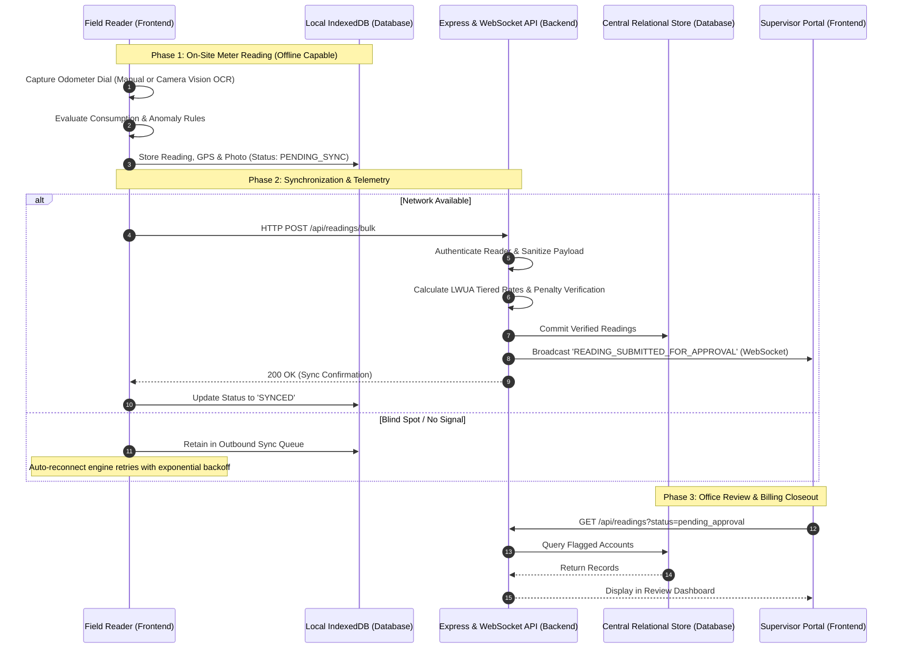

# Tagoloan Water District (WDT) Meter Reading System
## Full-Stack Project Architecture & Structural Justification Document

---

## 1. Executive Summary & Architectural Identification

The **Tagoloan Water District (WDT) Field Meter Reading, Tiered Billing, and Offline Synchronization System** utilizes a modern, decoupled **Separated Three-Tier Architecture** (Frontend, Backend, and Database). 

### Primary System Tiers
| Tier / Layer | Core Technologies | Primary Responsibilities |
| :--- | :--- | :--- |
| **Frontend Tier** | React 19, Vite, TypeScript, Tailwind CSS, Motion, Lucide Icons | Mobile-responsive Field Reader UI, Camera Vision Dial OCR, Local Storage (IndexedDB/Cache), Route Navigation, Bluetooth ESC/POS Receipt Formatting |
| **Backend Tier** | Node.js, Express, WebSocket (`ws`), TypeScript, REST API Engine | Central API Routing, Staff/Reader Authentication, LWUA Tiered Tariff Billing Engine, Real-Time WebSocket Telemetry, Batch Sync Verification, Ingestion Pipeline |
| **Database Tier** | Relational / Document Store (IndexedDB client-side + SQL/PostgreSQL/MySQL server-side schema) | Persistent Storage of Consumers, Meter Master Records, Reading Histories, Barangay Routes, Audit Logs, and Payment Queues |

---

## 2. Standardized Directory Organization

```
project/
├── frontend/                        # CLIENT-SIDE PRESENTATION & LOGIC
│   ├── public/                      # Static assets, Web App Manifests, PWA icons
│   │   ├── favicon.ico
│   │   ├── manifest.json
│   │   └── icons/
│   │
│   ├── src/                         # Application source code
│   │   ├── assets/                  # Branding assets, vector logos, district seals
│   │   │   └── branding.ts
│   │   │
│   │   ├── components/              # Reusable UI & presentation components
│   │   │   ├── OfficialLogo.tsx
│   │   │   ├── WDTHeader.tsx
│   │   │   ├── WDTBottomNav.tsx
│   │   │   ├── MobileFrameWrapper.tsx
│   │   │   ├── ModuleLoadingScreen.tsx
│   │   │   ├── ScanOverlay.tsx
│   │   │   ├── ThermalReceiptModal.tsx
│   │   │   ├── WebSocketActivityFeed.tsx
│   │   │   └── DownloadApkModal.tsx
│   │   │
│   │   ├── screens/ (pages/)        # Application modules & views
│   │   │   ├── LandingScreen.tsx
│   │   │   ├── LoginScreen.tsx
│   │   │   ├── DashboardScreen.tsx
│   │   │   ├── ConsumersScreen.tsx
│   │   │   ├── ConsumerDetailsScreen.tsx
│   │   │   ├── ScanMeterScreen.tsx
│   │   │   ├── ReadingEntryScreen.tsx
│   │   │   ├── BatchSubmissionScreen.tsx
│   │   │   ├── HistoryScreen.tsx
│   │   │   ├── AuditLogScreen.tsx
│   │   │   ├── MeterReadersScreen.tsx
│   │   │   ├── DebugScreen.tsx
│   │   │   └── FlutterConfigScreen.tsx
│   │   │
│   │   ├── services/                # Client-side API, hardware & storage drivers
│   │   │   ├── api.ts               # Central REST API connector
│   │   │   ├── apiConfig.ts         # Endpoint routing & offline fallbacks
│   │   │   ├── websocketService.ts  # Real-time WebSocket client & backoff reconnect
│   │   │   ├── syncService.ts       # Offline-first queue & batch sync engine
│   │   │   ├── databaseHelper.ts    # IndexedDB / SQLite client abstraction
│   │   │   ├── calculationService.ts# LWUA tiered tariff formula & anomaly traps
│   │   │   ├── locationService.ts   # Device GPS coordinates driver
│   │   │   ├── ocrService.ts        # Computer vision & meter odometer extraction
│   │   │   ├── realTimeScanner.ts   # High-speed canvas frame processor
│   │   │   ├── loggerService.ts     # Client audit log persistence
│   │   │   └── installService.ts    # PWA / WebAPK install manager
│   │   │
│   │   ├── constants/               # System configurations, rate tables, barangays
│   │   │   ├── branding.ts
│   │   │   └── routes.ts
│   │   │
│   │   ├── types/                   # Unified TypeScript interfaces & schemas
│   │   │   └── index.ts
│   │   │
│   │   ├── App.tsx                  # Root state container, routing & screen transitions
│   │   ├── main.tsx                 # Client application entry point
│   │   └── index.css                # Global Tailwind CSS styling & animations
│   │
│   ├── index.html                   # HTML entry point with viewport configuration
│   ├── vite.config.ts               # Vite build tool and bundler configuration
│   └── package.json                 # Client dependencies & scripts
│
├── backend/                         # SERVER-SIDE API, BUSINESS RULES & SOCKETS
│   ├── server.ts                    # Server entry point (Express + WebSocket Server)
│   ├── api/                         # RESTful API Route Handlers & Controllers
│   │   ├── auth.ts                  # Reader sign-in, PIN verification & session tokens
│   │   ├── consumers.ts             # Consumer registry query & route segmentation
│   │   ├── readings.ts              # Reading intake, verification & anomaly evaluation
│   │   ├── readers.ts               # Field staff management & route assignment
│   │   ├── sync.ts                  # Batch sync endpoint & conflict resolution
│   │   ├── health.ts                # Service health checks & WebSocket state
│   │   └── _utils.ts                # Response formatters & security helpers
│   │
│   ├── middlewares/                 # Middleware layer
│   │   ├── cors.ts                  # CORS headers & origin whitelisting
│   │   ├── authMiddleware.ts        # Role verification & token checking
│   │   └── errorHandler.ts          # Centralized error trapping & audit logging
│   │
│   └── package.json                 # Server runtime dependencies
│
├── database/                        # DATA PERSISTENCE & SCHEMAS
│   ├── schema.sql                   # Relational database schema (PostgreSQL / MySQL)
│   │                                # (Consumers, Meters, Readings, Billings, AuditLogs)
│   ├── client_storage/              # Client-side IndexedDB persistence structures
│   │   └── schema.ts                # Local stores: 'consumers', 'readings', 'logs'
│   └── seeds/                       # Seed records for Tagoloan 12 Barangay zones
│       └── tagoloan_seed_data.json
│
└── config/                          # SYSTEM CONFIGURATION & DEPLOYMENT
    ├── .env.example                 # Environment variables template
    ├── tsconfig.json                # TypeScript compiler configuration
    └── metadata.json                # Application metadata & platform permissions
```

---

## 3. Project Architecture Justification

### Why a Separated Frontend–Backend Architecture is Superior

#### 1. Separation of Concerns (SoC)
* **Presentation vs. Computation**: The Frontend is dedicated to high-performance user interaction—rendering touch-friendly screens, animating transitions, processing camera frames for dial OCR, and formatting thermal receipts. 
* **Business & Security Logic**: The Backend is dedicated to sensitive, authoritative tasks—validating meter serial numbers, computing LWUA tiered tariffs, enforcing role-based permissions, verifying reading anomalies, and committing transactions to persistent storage.
* *Benefit*: A change in the mobile UI styling or receipt layout will never compromise or break the billing calculation logic or database integrity.

#### 2. Native Multi-Platform Support (API Reusability)
* The same Node.js/Express backend API serves multiple consumer channels simultaneously:
  1. **Field Reader Mobile App** (PWA/Android): Uses `/api/readings/bulk` and WebSocket telemetry.
  2. **Billing Supervisor Web Dashboard**: Uses `/api/readings` to approve anomalies and review field progress.
  3. **Cashier / Teller Terminal**: Uses `/api/consumers` and `/api/readings` to query bills and record payments.
  4. **Consumer Self-Service Portal**: Queries historical consumption and bill copies.
* *Benefit*: Eliminates duplicated business logic across different device clients.

#### 3. Zero-Data-Loss Offline Synchronization
* Water utility field personnel in Tagoloan often read meters in low-signal or remote barangay zones (e.g., Sta. Ana, Baluarte, rural Casinglot).
* With this architecture, the Frontend houses a local database client (`IndexedDB`/`SQLite`) that immediately stores every reading, GPS coordinate, and dial photo offline.
* When connectivity returns, the Frontend dispatch engine batches records and transmits them to `/api/readings/bulk` on the Backend without user intervention.

#### 4. Enterprise-Grade Security & Audit Integrity
* Allowing a client-side device to connect directly to the central database introduces major vulnerabilities (exposed database credentials, SQL injection, arbitrary writes).
* In this architecture, all interactions pass through the Node.js/Express Backend layer, which enforces authentication, input sanitization, rate limiting, and server-side validation.
* Every operation is committed to a tamper-evident audit trail with reader IDs, timestamps, and GPS verification.

#### 5. Scalability & High-Throughput Performance
* The frontend bundles static HTML, CSS, and TypeScript assets via Vite, enabling instant loading on mobile devices.
* The backend runs an asynchronous Node.js event loop with dedicated WebSocket workers (`ws`), capable of handling hundreds of concurrent meter readers streaming live updates without blocking CPU threads.

---

## 4. End-to-End Operational Lifecycle Mapping



---

## 5. Conclusion

Adopting a separated **Frontend | Backend | Database** architecture provides the Tagoloan Water District with a secure, highly scalable, and offline-resilient field operations platform. It adheres to industry-standard software engineering practices, guarantees seamless team collaboration, and supports long-term technological expansion.
